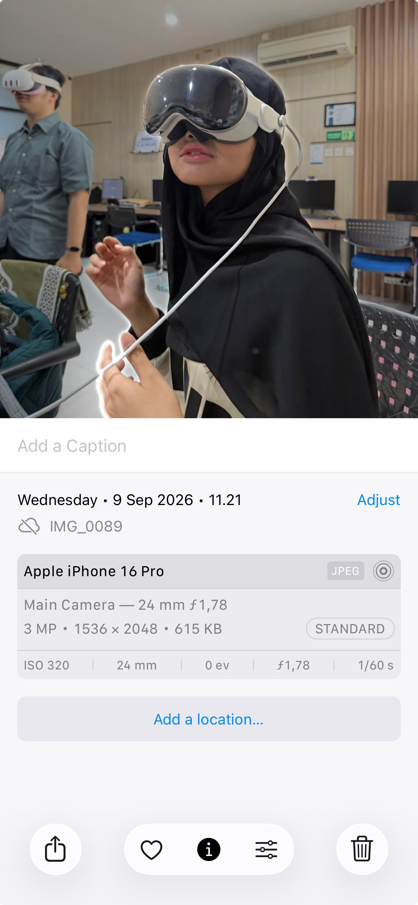
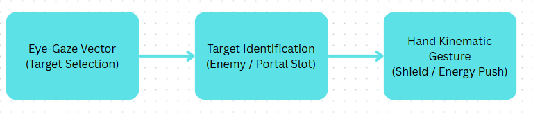

# XR Teardown — What if….? - An Immersive Story

**5025231067 — Sinta Probondari Wardani** · S1 Informatics · Individual Assignment 1

|                           |                                                                    |
| ------------------------- | ------------------------------------------------------------------ |
| Subject                   | What if....? - An Immersive Story                                  |
| Publisher / manufacturer  | Developed by ILM Immersive (Lucasfilm) in collaboration with Marvel Studios, published via Disney+ as an interactive app. |
| Release or major update   | May 30, 2024                                                       |
| Platform(s)               | visionOS                                                           |
| How I examined it         | Hands-on session & technical documentation                         |
| Hands-on date(s)          | 9 September 2026                                                   |

> **My claim in one sentence.** What If...? – An Immersive Story proves that spatial narrative can achieve AAA cinematic presence, but relying exclusively on unassisted hand gestures and eye tracking creates an ergonomic bottleneck that limits high-speed combat gameplay.

---

## 1. Device class

What if....? - An Immersive Story targets an optical-passthrough standalone spatial computer, specifically the Apple Vision Pro (visionOS). The physical device features twin micro-OLED panels delivering 23 million pixels across both eyes, powered by a dual-chip architecture (M2 for system compute and R1 for low-latency sensor processing).

The application spans a dynamic segment of Milgram's Reality-Virtuality Continuum. It begins in Mixed Reality (MR) via video passthrough, where the local physical room geometry is scanned and integrated into the scene. Mystic portals and narrative characters anchor relative to real-world surface planes (tables, floors, and walls). During interactive combat sequences, the experience smoothly scales transparency toward Virtual Reality (VR), fully occluding the pass-through feed with rendered 3D environments like the Astra plane or cosmic Multiverse realms.

What this class forces on the design:

**1. Vergence-Accommodation Conflict (VAC) Constraints:** Because the display focal distance is fixed (around 1.3 meters), interactive UI and magical spell runes cannot be placed too close to the user's face without causing severe eye strain. Spells must be projected outward into the room space.

**2. Thermal & Power Budgets:** Running real-time stereoscopic rendering alongside 12-camera optical sensor fusion limits sustained high-polygon mesh rendering. To compensate, the developers rely on stylized cel-shaded shaders mirroring the animated Disney+ series rather than photorealistic ray tracing.

**3. Sensor Field-of-View (FoV) Bounds:** Interaction mechanics depend on the lower-facing cameras detecting the user's hands. Dropping hands below the lap causes tracking loss, requiring explicit user prompt feedback.

---

## 2. Input modality

**What the user does:** The application relies on a controller-free spatial input schema: a combination of foveated eye-gaze selection and skeletal hand-tracking micro/macro gestures.

- **Primary Targeting:** The user's eye-gaze position acts as the primary cursor ray. Looking directly at an enemy, a narrative choice, or an interactive spell target selects it.
- **Spell Activation & Kinematics:** To cast mystic spells, the user performs macro hand gestures like crossing wrists, forming circular gestures, or thrusting open palms forward.

**Why this and not that:** The developers chose a controller-free input system over standard 6DoF spatial motion controllers.

- **What it bought:** Eliminating hardware controllers removes friction for non-gamer audiences, matches the media-first identity of the Apple Vision Pro platform, and allows organic physical pose transformations (like crossing wrists to cast a shield or thrusting open palms forward) that mirror the superhero power fantasy without holding plastic grips.
- **What it gave up:** The design completely sacrifices physical haptic feedback, deterministic button clicks, and zero-latency tracking. In fast combat, players lose the tactile confirmation of blocking an attack or firing an energy beam, relying entirely on visual particle effects and spatial audio.

**Where it fails:** This can be broken down across three distinct failure modes:
- **Self-Occlusion during Kinematic Gestures:** Doctor Strange-style spell casting requires crossing wrists or holding hands in complex layered geometry. When one hand passes directly in front of another, the Vision Pro's downward-facing tracking cameras lose line-of-sight on the rear fingers, causing joint tracking to drop or freeze mid-cast.
- **"Midas Touch" & Saccadic Fatigue:** Forcing eye-tracking to serve as a continuous spatial aiming reticle during combat creates severe ocular fatigue. Because human eyes make involuntary jumpy movements (saccades), precision aiming at moving multiversal targets causes twitchy targeting and unintended activations.
- **Camera Field-of-View Boundaries & Arm Fatigue:** If a player lowers their hands into their lap while sitting or moves their arms too quickly during combat, the hands drop out of the tracking volume, causing gestures to fail. Conversely, forcing extended mid-air macro gestures leads directly to "gorilla arm" physical fatigue within 15–20 minutes.

**What I would change:** I would implement **Magnetic Gaze-Target Auto-Snapping paired with Low-Amplitude Micro-Gesticulation**. Instead of requiring point-exact gaze vector alignment during rapid combat, eye tracking should define a forgiving 5-degree target region that auto-snaps to the nearest enemy or portal slot. Simultaneously, macro full-arm motions (like wide circular portal sweeps) should be mapped to small, low-effort micro-gestures (such as index-thumb pinches with subtle wrist rotation) executed down in the lap. This preserves high tracking stability by keeping hands within the primary camera cone, mitigates arm fatigue, and eliminates ocular strain caused by aggressive eye aiming.

---

## 3. Use of AI

| Where | What it does | On-device or cloud | Source + the line I am relying on |
| :--- | :--- | :--- | :--- |
| **Perception** | Real-time skeletal hand pose estimation & 3D finger joint tracking | On-Device (Apple R1 Chip / Neural Engine) | [YouTube Developer Demo](https://www.youtube.com/watch?v=lLk-IkPktMo) — *"Fans will use their hands and eyes to interact with the world around them, becoming immersed with vivid visuals and spatial audio"* |
| **Perception** | Room geometry reconstruction & spatial surface mesh generation via LiDAR processing | On-Device (Apple Neural Engine) | [Disney Press Release](https://thewaltdisneycompany.com/news/marvel-ilm-apple-vision-pro-immersive-what-if/) — *"Transforms the space around them as they traverse across realms"* |
| **Rendering & Delivery** | Eye-tracked foveated rendering (dynamically lowering render resolution in peripheral vision) | On-Device (Apple M2 GPU / R1 Core) | [Apple App Store](https://apps.apple.com/us/app/what-if-an-immersive-story/id6479251303) — *"Cast dynamic spells, defend your allies, and battle against villains using custom hand gestures and eye gaze."* |

Artificial intelligence in *What If…? – An Immersive Story* is load-bearing, but strictly within the on-device perception and computer vision pipeline rather than content generation. The application does not use cloud-based Generative AI or dynamic LLM dialogue agents; all narrative branches, character responses, and story paths are pre-authored 3D animatics operating on fixed decision trees. However, on-device machine learning models running on Apple's Neural Engine and R1 chip are indispensable. They perform continuous skeletal hand pose estimation, low-latency joint inference, and LiDAR spatial surface reconstruction. Generative AI was likely avoided because network API latency spikes would break real-time spatial immersion, and unscripted generative responses risk introducing lore hallucinations that violate strict Disney/Marvel intellectual property guidelines.

---

## 4. Impact

**Intended benefit:** It demonstrates a production blueprint for AAA narrative transmedia, proving that linear cinematic content (Disney+ series) can be converted into interactive spatial computing where the audience transitions from passive viewers to active first-person participants.

**Privacy, security, or ethics:** The app relies on visionOS sandboxing. Raw camera feeds and raw eye-tracking vectors are never accessible to the Disney / ILM application layer; only high-level gesture and event triggers are passed. As confirmed in the official App Store disclosure: *"Data Not Collected: The developer does not collect any data from this app."*

**Accessibility / human factors:** This app heavily relies on dual-hand physical mobility and unassisted vertical posture. Users with severe motor impairments, upper-limb amputations, or restricted arm movement cannot execute macro gestures like crossing wrists or drawing wide circles in the air. Furthermore, the absence of alternative input remapping (such as single-switch or dwell-based selection alternatives) creates an accessibility barrier for motor-impaired players.

---

## 5. What I take from this

What If…? – An Immersive Story shows that while XR can now deliver movie-quality visuals right in our living rooms, its controls are still holding it back. It proves that using just your eyes and hands works great for simple menus, but quickly becomes tiring and inaccurate during intense superhero combat. Overall, spatial storytelling is making huge leaps forward, but we are still stuck trying to make controller-free actions feel as precise and comfortable as traditional gaming.

---

## References

1. Apple Inc. (2024). *Apple Vision Pro Technical Specifications & visionOS Architecture*. Apple Developer Documentation. https://developer.apple.com/visionos/
2. Marvel Studios & ILM Immersive. (2024). *Marvel Studios and ILM Immersive Announce "What If…? – An Immersive Story"*. Marvel.com Newsroom. https://www.marvel.com/articles/culture-lifestyle/marvel-studios-ilm-immersive-what-if-an-immersive-story-apple-vision-pro-exclusive
3. Lang, Ben. (2024). *Vision Pro and Quest 3 Hand-tracking Latency Compared*. Road to VR. https://www.roadtovr.com/apple-vision-pro-meta-quest-3-hand-tracking-latency-comparison/
4. Milgram, Paul & Kishino, Fumio. (1994). *A Taxonomy of Mixed Reality Visual Displays*. IEICE Transactions on Information and Systems, E77-D(12), 1321–1329. https://www.researchgate.net/publication/220267562_A_Taxonomy_of_Mixed_Reality_Visual_Displays

---

## Figure credits

- **Fig. 1** — Trying out the Apple Vision Pro at Lab GIGA (Captured during hands-on evaluation, 9 Sep 2026).
- **Fig. 2** — In-game spell casting gesture (Source: Youtube [https://www.youtube.com/watch?v=UTkmRwzuxHw]).
- **Fig. 3** — Diagram of eye-gaze tracking vector and skeletal hand joint tracking bounds on visionOS (Original diagram created by author).

---

## AI-assistance disclosure

**What I used, and for what:** Gemini was used to assist in retrieving developer references and structuring initial drafts for this evaluation.

**Rebuttal & Critical Evaluation:**
During our initial discussion, the AI assistant claimed that *What If…? – An Immersive Story* used cloud-based Generative AI and LLMs to create real-time, changing dialogue for characters like Wong and The Watcher. I rejected this claim because it was unsupported by primary sources. After checking the official ILM Immersive press releases and Apple App Store architectural details, I confirmed that all character lines and story choices are pre-recorded 3D animatics running on fixed script trees. Instead of using the AI's incorrect claim, I reframed the analysis to focus on where machine learning is actually used in the app: running locally on the headset's Neural Engine to track hand movements and map room walls in real time.
